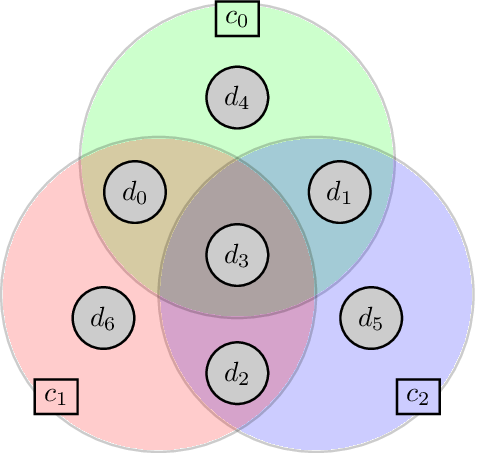

# Classical Error Correction


```table-of-contents
```

## Resources:
I advise Arthur Pesah's blog post on classical error correction (https://arthurpesah.me/blog/2022-05-21-classical-error-correction/) and the Hamming code pair of videos from 3Blue1Brown on Hamming code (https://www.youtube.com/watch?v=X8jsijhllIA) complementary to this lecture.
Deeper knowledge on information theory and classical error correction can be found in Information Theory, Inference, and Learning Algorithms, by David McKay.

## Introduction with repetition code

Let's assume that we have a noisy classical system which encodes information on bits and which is used to transfer classical information from Alice to Bob.
Each bit can suffer a bit flip with a probability $p$ which we assume to be small: $p\ll 1$, but Alice want to transfer information to Bob faithfully (with error probability $\ll p$ for example).

How can she proceed?
One natural way to tackle this problem is to encode her classical information redundantly onto multiple physical bits, using what we call a repetition code.

The logical information that she wants to transfer is $i_L = 0_L$, or $1_L$ (I am using the subscript $L$ to denote that this information is logical).

She encodes it into $n$ physical bits:
$$i_L = i i \dots i$$

For example if $n=3$, $0_L = 000$ and $1_L = 111$.

She now transfer all these $n$ bits to Bob.
Yet, these bits can suffer noise with probability $p$.
We assume that the noise corresponds to a bit flip: $i \mapsto 1 - i$.


Therefore Bob can receive multiple bit strings.
Assume that Alice have sent $0_L = 000$ ($n=3$). Bob can receive:
- 000 with probability $(1 -p)^3 \approx 1 - 3p$
- 001, 010, 100, each with probability $p(1 -p)^2 \approx p$. These results corresponds to having exactly one error
- 110, 101, 011, each with probability $p^2 (1 - p) \approx p^2$. These results corresponds to having exactly 2 errors
- 111 with probability $p^3$. This corresponds to having exactly 3 errors.

Note that Bob does not know whether Alice have sent $0_L$ or $1_L$, the last two results could very well corresponds to Bob receiving $1_L = 111$ and having no errors or receiving 110, 101, 011, and having exactly one error.

Bob's decoding strategy is thus to identify the most likely error and extract information accordingly. In this case, Bob will rule the first two types of results (000, 001, 010, 100) as coming from $0_L$ and the last two types of results (111, 110, 101, 011) as having received $1_L$. He uses a decoding strategy that fits well with the repetition code under the bit flip model which is called a majority vote.

In doing so, Bob could still make an error, that will affects the logical qubit, but this logical error has probability:
$$p_L = 3 p^2 (1 - p) + p^3 \approx 3 p^2$$
If $p_L < p$, which is the case whenever $p \ll 1$, the logical error is smaller than the physical error and Bob receive information in a much more reliable way.

Important remarks:
- The repetition code performance depends on the number of physical bits.
- It also depends on the error model being used.
- The decoding strategy depends on the code being used

The strategy is summarized in 


### Exercises:
1. Given a $n$ bit repetition code. What is the probability of having exactly $m$ errors?
2. How many errors can we correct with this code?
3. Assuming that we have $n=3$, and an amplitude damping error model ($0 \mapsto 0$, $1 \mapsto 0$) with probability $p$. What is the probability of having a logical error?
4. Can you summarize the new decoding strategy that you've used?
5. Assuming that we have $n=3$, and an  erasure error model ($0 \mapsto \emptyset$, $1 \mapsto \emptyset$) with probability $p$. What is the probability of having a logical error?
6. With this erasure error model, having an $n$-bit repetition code, how many erasure can we correct?

(Amplitude damping model) 


(Erasure model:)
  


1. $P(m) = {n\choose m} p^m (1 - p)^{n-m}$
2. We can correct up to $\lfloor(n-1)/2\rfloor$ errors with the majority vote
3. If the logical information is $0_L$, there's no possible errors. If $1_L$, the probability of having an error is $p^3$.
4. If there's a $1$ somewhere on the physical qubits, the logical information is decoded to $1_L$
5. The probability is again $p^3$.
6. in general $p^n$.


The repetition code provides good intuition on how a code is working, but it is far from the best we can do with classical coding theory. In the following, we will briefly present it in a more mathematical way.


## Basics of coding theory.

We consider here binary linear codes:
- binary: means that information is encoded onto bits
- linear: means that if $c$ and $c'$ are valid encoded information $c \oplus c'$ is also in the code.
These are restrictions: not all codes are binary (we can encode information onto dits and use error correcting codes on dits) and we can also have nonlinear codes ($\{1_L = 110, 0_L=001\}$ is a small example of a nonlinear code ).
### Bits:

We consider a bit to be an element of $\mathbb F_2$, the Galois field of two elements $\{0, 1\}$.
It has two operations, an addition modulo 2:
$$i \oplus j = i + j \mod 2,$$


$$0 \oplus 0 = 0, \quad 1 \oplus 0 = 0 \oplus 1 = 1, \quad 1 \oplus 1 = 0,$$

and a multiplication:
$$0.x = 0, \quad 1.x= x.$$


Additionnally a $n$-bit bitstring will be a vector $i = (i_0, i_1, \dots, i_{n-1}) \in {\mathbb F_2}^n$ and the bitwise addition gives:
$$i \oplus j = (i_0 \oplus j_0, i_1 \oplus j_1, \dots, i_{n-1} \oplus j_{n-1}) $$

We also define some mathematical object that will be useful later:
The bitstring's weight:
$$
\begin{align}
w: {\mathbb F_2}^n & \mapsto \mathbb N  \nonumber\\
c=(c_0, \dots, c_{n-1}) & \mapsto w(c) = \sum_{i=0}^{n-1} c_i \nonumber
\end{align}
$$
which is essentially counting the number of 1s in a bitstring.

And the bitstring distance:
$$
\begin{align}
d: {\mathbb F_2}^n \times {\mathbb F_2}^n & \mapsto \mathbb N  \nonumber \\
 c, c' & \mapsto d(c, c') = w(c \oplus c') \nonumber
\end{align}
$$


*In all generality, codes does not need to be defined on binary fields. It can for example be on  $q$-ary fields with $\mathbb F_q$.*


#### Bitstring sphere/ balls:
- A sphere of radius $r\in \mathbb N$ and center $b \in {\mathbb F_2}^n$, is the set of all the bitstrings that differ from $b$ by exactly $r$ bits:
$$S(b, r) = \{b' \in {\mathbb F_2}^n | d(b,b') = r\}$$

- A ball of radius $r\in \mathbb N$ and center $b \in {\mathbb F_2}^n$, is the set of all the bitstrings that differ from $b$ by at most $r$ bits:
$$B(b, r) = \{b' \in {\mathbb F_2}^n | d(b,b') \leq r\}$$

We have the following properties 
$$|S(b,r)| = {n\choose r}$$
and
$$|B(b,r)| = \sum_{r'=0}^r {n\choose r'}$$
since 
$$B(b,r) = \sqcup_{r'=0}^r S(b,r')$$

### Error correcting codes

#### Definition: Linear error correcting code
A linear classical error correcting $C$ is a map from ${\mathbb F_2}^k$ to ${\mathbb F_2}^n$ (with $n \geq k$). This map can be represented by a $k \times n$ generator binary matrix $G \in {\mathbb F_2}^{k \times n}$: 
$$
\begin{align}
C: {\mathbb F_2}^k & \mapsto {\mathbb F_2}^n  \nonumber \\
 m & \mapsto c = C(m) = m G \nonumber
\end{align}
$$

- $m \in {\mathbb F_2}^k$ is usually called the message. 
- $c \in {\mathbb F_2}^n$ is usually called the codeword. 


Such a code $C$, thus encode the $k$-bitstrings into larger $n$-bitstrings in such a way that we can identify errors.

$${\rm Im}(C) = \{C(m) | \forall m \in {\mathbb Z_2}^k\} = C\left({\mathbb F_2}^k\right)$$
defines the subspace of all valid codewords.

#### Definition: Parity check matrix
We can define a parity check matrix $H \in {\mathbb F_2}^{r \times n}$, of rank $n-k$, that nullifies the code's subpsace:
$$
{\rm Im}(C) = \ker{H} = \{c \in {\mathbb F_2}^n | Hc = 0\}.
$$


*(We will be a bit loose on notations for bitstrings where $c \in {\mathbb F_2}^n$, will be either considered as a vector row or column... For example, $c = m G$ suggest that $c$ is a row vector, while $Hc=0$ suggests that $c$ is a column vector. So strictly speaking we should write $H c^T = 0$...)*

(If $r > n-k$ some rows of $H$ can be written as linear combinations of $n-k$ others. Therefore, in practice if we restrict to these $n-k$ rows, we still have ${\rm Im}(C) = \ker{H}$, and we can restrict ourselves to taking $r=n-k$.)

Usually we abusively identify the code's subpsace with the code itself, ${\rm Im}(C) \sim C$. We will do this as well in the following. Under this assumption, a code is entirely defined by its parity check matrix.


The parity check matrix is quite interesting as it will help identify errors.
Indeed assuming that $c \in C$ is a valid codeword and assume that $e \in {\mathbb F_2}^n$ is some error afflicting the bitstring, the noisy bitstring $\tilde c = c \oplus e$ can be multiplied by the parity check matrix:
$$H \tilde c = H(c \oplus e) = H c \oplus H e = He = s.$$
Here, we have used the fact that $Hc= 0$ for any valid codeword.
$s = He$ is called the syndrome of an error, it corresponds to the information about an error acting on our codewords.

Note that if $He = 0$, $e$ is itself a valid codeword and cannot be detected, nor corrected.
An important figure of merit of a code $C$ is its Hamming distance.

#### Definition: (Hamming) distance of a code
The (Hamming) distance of a code is the minimum weight of an undetectable error. It is given by:
$$
d_H: C \mapsto \min\left[ d(c, c')  | \forall c \neq c' \in C^2\right]
$$

Any error $e$ that has a weight strictly below the code's distance, $e<d_H$, leaves a non-zero syndrome: $He = s \neq 0$. The error is detectable.

#### Code terminology

A code thus encode $k$ logical bits into $n$ physical bits to detect any error of weight below $d_H$. This code is usually represented with the compact notation "$[n,k,d]$".
- $n$ is the number of physical bits, also called the code's length
- $k$ is the number of logical bits, also called the code's dimension.
- $d$ is the Hamming distance of the code (or simply the code's distance for short).

We can also define the code's encoding rate $R = k/n$ which is the ratio between the number of logical and physical bits.

$\delta = d/n$ is also a relevant number called the code's relative distance.


#### Dual codes

Given a code $C$, with generator matrix $G$ and parity check matrix $H$, any codeword $c \in C$ can be written as $c = m G$ and we have $Hc = 0$.
Therefore,
$$H G^T = 0$$
Note that if we take the transpose of this equation, the roles of $H$ and $G$ are interverted,
$$G H^T=0,$$
suggesting the existence of another code with parity check matrix $G$ and generator matrix $H$. This code is the dual code $C^\perp$.

##### Canonical form:
Given a parity check matrix $H$, we can find a generator matrix $G$ of the form:
$$G = \begin{pmatrix}I_{k} &  P\end{pmatrix},$$
with $P$ a full-rank matrix. This block form is known as the canonical form of a code. The additional $n-k$ matrix are sometimes called the parity bits

Similarly, $H$ can be made in a canonical form:
$$H = \begin{pmatrix}P^T &  I_{n-k}\end{pmatrix},$$
*(On $q$-ary fields, $\mathbb F_q$ with $q \neq 2$, it would be $H = \begin{pmatrix}- P^T & I_{n-k}\end{pmatrix}$, but for binary fields $-P^T = P^T$)*

#### Definition: A family of code.
A family of code $\mathcal F = \{C_n \subset  {\mathbb F_2}^n \}_{n \in I}$ is a collection of codes of increasing length indexed by some set $I \subset \mathbb N$ with a uniform rule (a single algorithmic or mathematical procedure) to construct all the codes.
If the set $I$ is not bounded, it is an infinite family of codes and we can define asymptotic behaviors, in particular, the asymptotic encoding rate and relative distance scaling:
$$R_\infty = \lim_{n \to \infty} (R_n = k/n)$$
$$\delta_\infty = \lim_{n \to \infty} (\delta_n = d/n)$$


#### Exercise:


1. What is the encoding matrix and the parity check matrix of the $3$-bit repetition code ?
2. Is 

$$H = \begin{pmatrix} 1 & 1 & 0 \\ 0 & 1 & 1 \\1 & 1 & 0 \end{pmatrix}$$
a valid parity check matrix of the 3-bit repetition code?
3. Generalize to $n$-bit repetition code ?
4. What is the asymptotic rate and relative distance of the repetition code?


In the case of the $3$-bit repetition code, the generator matrix is
$$G = \begin{pmatrix} 1 & 1 & 1 \end{pmatrix}$$


The parity check matrix of the $3$-bit repetition code is
$$H = \begin{pmatrix} 1 & 1 & 0 \\ 0 & 1 & 1 \end{pmatrix}$$


### Tanner graph of a code


A visual representation of a code is given by its Tanner graph. The Tanner graph $T(C) = (D \sqcup C, E)$ is a bi-partite graph ($E \subset (D \times C)$). Its vertex set is composed of the data bit set $D$ (with $|D| = n$), and check set $C$ (with $|C| = n - k$). Its bi-adjacency matrix is the code's parity check matrix $H$. This means that:

$$
\forall d \in D \sim \mathbb Z_n, \forall c \in C \sim \mathbb Z_{n-k}, \quad (d, c) \in E \Leftrightarrow H_{c, d} = 1.
$$
In other words, the $D$ set corresponds to data bits, i.e. the columns of the parity check matrix, and the $C$ set corresponds to the rows of the parity check matrix, that is the constraints that needs to be fulfilled by the code. There's an edge between a data bit and a check if the check acts non trivially on this data bit.

Here's the Tanner graph of the 3-bit repetition code:


#### Exercise Hamming code



In this picture, the nodes corresponds to the physical bits, and the circles to check constraints: the sum (mod 2) of all the bits within the same circle should be equal to zero.

1. Can you write the parity check matrix of the Hamming code?
2. Cannonical form?
3. Can you draw its Tanner graph?
4. What is the code's length? Its dimension?
5. Can the following matrix be the generator matrix of the Hamming code. 
$$G = \begin{pmatrix}
1 & 0 & 0 & 0 & 1 & 1 & 0 \\
0 & 1 & 0 & 0 & 0 & 1 & 1 \\
0 & 0 & 1 & 0 & 1 & 0 & 1 \\
0 & 0 & 0 & 1 & 1 & 1 & 1 \\
\end{pmatrix}$$
6. Assuming we have a syndrome $He = s = (0, 0, 1)^T$. What is the most likely error (assuming a bitflip error model)?
7. The distance of this code is $3$, what's the minimum number of errors it can detect?

/ Correction
1. 
$$\begin{pmatrix}
1 & 1 & 0 & 1 & 1 & 0 & 0 \\
1 & 0 & 1 & 1 & 0 & 0 & 1 \\
0 & 1 & 1 & 1 & 0 & 1 & 0 \\
\end{pmatrix}$$
2.  We can put it in the canonical form:
$$\begin{pmatrix}
1 & 1 & 0 & 1 & 1 & 0 & 0 \\
0 & 1 & 1 & 1 & 0 & 1 & 0 \\
1 & 0 & 1 & 1 & 0 & 0 & 1 \\
\end{pmatrix}$$
3. ...
4. [n=7, k=4] (the cannonical form ensure that the check matrix is of rank $n-k=3$)
5. Nope $H G^T \neq 0$
6. $e=(0, 0, 0, 0, 0, 1, 0)$
7. 1 bitflip

### Noise models

In coding theory, noise is modelled by a channel which is a probabilistic mapping that takes a bitstring and output a noisy bitstring.

$$
	\begin{align}
	\mathcal N: {\mathbb F_2}^n & \mapsto {\rm Prob}[{\mathbb F_2}^n] \; ({\rm or} \; {\rm Prob}[\{0, 1, \emptyset\}^n]) \\
	x & \mapsto P(y | x)
	\end{align}
$$
It is given by a set of conditional probability distributions that links the output words to the input words.

The case where the output words include $\emptyset$ corresponds to erasure and will be treated separately.

Such that:
$$
\sum_{y \in {\mathcal F_2}^n} p(y | x) = 1, \quad p(y|x)\geq 0
$$
The channel takes input $x$ and outputs $y$ according to the probability distribution $P(y|x)$.
###### Symmetric channel
A channel is symmetric if there exists a probability distribution $p(e)$ over ${\mathbb{F}_2}^n$​ such that for all input $\forall x \in {\mathbb F_2}^n$ and outputs $\forall y \in {\mathbb F_2}^n​$:
$p(y|x)=p(y\oplus x) = p(e)$

where the error vector $e=y \oplus x$ is independent of $x$.

###### Memoryless channel:
If $\forall y, x \in {\mathbb F_2}^n$

$$p(y|x) = \prod_{i=1}^n p(y_i|x_i)$$
The channel is said to be memoryless. Otherwise it is said to be correlated.

#### Examples of channels
##### Binary Symmetric channel
The binary symmetric channel is the memoryless channel ($p(y|x) = \prod_{i=1}^n p(y_i|x_i)$)
where each bit experience a bitflip with probability $p$:
$$\forall i \in \mathbb Z_n, \quad p(y_i=x_i\oplus 1 | x_i) = p, \quad p(y_i=x_i|x_i) = 1-p $$
This is described by this graph:


This is a symmetric channel


##### Amplitude damping channel
The amplitude damping channel is the memoryless channel ($p(y|x) = \prod_{i=1}^n p(y_i|x_i)$)
where each bit experience an amplitude damping ($1 \to 0$) with probability $p$:
$$\forall i \in \mathbb Z_n, \quad p(0 | 1) = p, \quad p(1 | 1) = 1-p, \quad p(0 | 0) = 1, \quad p(1 |0) = 0 $$
This is described by this graph:


This is not a symmetric channel, the error depends on the input

##### Erasure channel
The erasure channel is the memoryless channel ($p(y|x) = \prod_{i=1}^n p(y_i|x_i)$)
where each bit experience an erasure (loss of information $b \to \emptyset$) with probability $p$:
$$\forall i \in \mathbb Z_n, \quad p(y_i = \emptyset | x_i) = p, \quad p(y_i = x_i | x_i) = 1-p, \quad p(y_i = x_i \oplus 1 | x_i) = 0$$
This is described by this graph: 


Interestingly, we can see that  if we obtain a value $y_i = \emptyset$, we had input $x_i=0$ or $x_i= 1$ with identical a priori probability $p = 1/2$, so we have "erased" the information of the $i^{\rm th}$ bit, hence the name erasure. What is important is that we know the location of this bit erasure: it is on the $i^{\rm th}$ bit and we can leverage this information to decode more accurately the error


### Decoding

The general problem setting of the decoding problem is the following: Alice send a message $m$ encoded into a codeword $c=Gm$. The message is sent through a noisy channel $\mathcal N$ to Bob who receives the noisy word $y = c \oplus e$ where $e$ is the error. To retrieve this message, Bob needs to find the most likely message $m$ that Alice could have sent him given that he received $y$:
$$\begin{align}
\mathcal D_{ML}: {\mathbb F_2}^{n} & \mapsto {\mathbb F_2}^{n} \nonumber\\
y & \mapsto \hat c = D_{ML}(y) = \arg \max_{ c' \in C} \left[ p(c' | y)\right] \nonumber
\end{align}$$
He succeeds if $\hat c = c$.

If the error $e$ is independent of the input word, the noise is said "symmetric" and the problem can be considered only looking at the parity check matrix. Note that this isn't the case for other types of noise such as amplitude damping errors which are acting differently on different input words: $p(e \oplus c = \mathcal N(c) | c) \neq p(e)$


Here, we briefly introduce the decoding problem. Assume that we have a noisy codeword $c \oplus e$ that leads to a syndrome $s = He$, under the binary symmetric channel. 
First we should note, that multiple errors could lead to the same syndrome: 
$s = He = He'$ for $e \neq e'.$
Therefore, in general it is impossible to identify and correct unambiguously an error.
In practice, errors occurs with a probability $p(e)$ ($p(e)$ is the probability that the bitstring error $e$ occurs). The best guess is thus to find the error with the largest probability that led to the syndrome $s$. The most efficient decoder is thus the following maximum likelihood decoder:

$$\begin{align}
\mathcal D_{ML}: {\mathbb F_2}^{n-k} & \mapsto {\mathbb F_2}^{n} \nonumber\\
s & \mapsto \hat e = D_{ML}(s) = \arg \max_{e \in {\mathbb F_2}^n} \left[ p(e) | \quad s = H e  \right] \nonumber
\end{align}$$

The maximum-likelihood decoder is in general NP-Hard, so in practice, we approximate it with more efficient decoders: $\mathcal D: {\mathbb F_2}^{n-k} \mapsto {\mathbb F_2}^{n}$. 


Note that $e \oplus \mathcal D(e)$ is a valid codeword since $H(e \oplus \mathcal D(e)) = He \oplus H\mathcal D(e) = s \oplus s = 0$.

The decoder successfully identify an error if:
$e \oplus \mathcal D(e) = 0$ that is $e = \mathcal D(e)$.


In that case, the noisy bitstring $c\oplus e$ is mapped back into the correct codeword by applying $\mathcal D(e)$ to the noisy bitstring: $c \oplus e \oplus \mathcal D(e) = c$.

In the erroneous case, the noisy codeword $c \oplus e$ is mapped to another valid codeword $c' = c \oplus e \oplus \mathcal D(e) \neq c$. The physical error has been converted into a logical error.

For an error model corresponding to having each bit being flipped with same probability $p$, the largest weight $t = w(e)$ of an error that can always be corrected by the ML decoder $\mathcal D_{M L}$ is linked to the Hamming distance $d_H$ : $t = \lfloor(d − 1)/2\rfloor$.
We therefore see that the Hamming distance is an important figure-of-merit of a code.

##### Exercise:
We will prove this statement:
1. Under binary symmetric noise channel (bitflip errors) with noise probability $p<1/2$, what is the probability corresponding to a given $n$-bitstring error $e$?
2. How does this relate to the weight $w(e)$? Given two errors $e$ and $e'$ with weights $w(e) < w(e')$ which one is a priori the most likely?
3. Show that under the binary noise channel, the decoder can be rewritten as a function of $w(e)$: 
4. If an error $e$, with syndrome $s$, has weight $w(e) \leq t =  \lfloor(d − 1)/2\rfloor$, what is the smallest weight of another error with identical syndrome $s$ ?
5. Conclude.

\ Correction
Memoryless
1. $p(e=(e_0, \dots e_{n-1})) = \prod_{i=0}^{n-1} p(e_i)$ with $\forall i, p(e_i = 1) = p$, $p(e_i = 0) = (1 - p)$
   So $\prod_{i=0}^{n-1} p(e_i) = p^{w(e)} (1 - p)^{n-w(e)}$
There's $w(e)$ ones in $e$ (and $(1 - w(e))$ zeros in $e$).

Therefore, $p(e)=p^{w(e)} (1 - p)^{n-w(e)}$.
2. For $p<1/2$, $p(e)$ is a decreasing function of $w(e)$, the more weight, the more unlikely the error: $w(e) < w(e') \Leftrightarrow p(e)>p(e')$
3. $$\begin{align}
\mathcal D_{ML}: {\mathbb F_2}^{n-k} & \mapsto {\mathbb F_2}^{n} \nonumber\\
s & \mapsto \hat e = D_{ML}(s) = \arg \max_{e \in {\mathbb F_2}^n} \left[ p(e) | \quad s = H e  \right] \nonumber
\end{align}$$
since $w(e) < w(e') \Leftrightarrow p(e)>p(e')$, 
$$\begin{align}D_{ML}(s) = \arg \min_{e \in {\mathbb F_2}^n} \left[ w(e) | \quad s = H e  \right] \nonumber
\end{align}$$
Decoders that solve this optimization problem is called a Maximum A Posteriori (MAP) decoder.
4. Let $e' \neq e$ be an error with syndrome $He'=He=s$, Therefore $e'\oplus e \neq c$ is a valid codeword. The code's distance is $d$ so $d(e' \oplus e, 0) = w(e \oplus e') = d(e, e') \geq d$. Given that $d$ is a distance $d \leq w(e \oplus e') \leq w(e) + w(e')$ and thus $w(e') \geq d - w(e) \geq d-t > t$
5. Any error with weight $t$ or lower is the smallest weight error and will be decoded. The decoder correct any errors of weight $t$ or lower.

#### Definition: Support of a bitstring
${\rm Supp}(e) = \{i \in \mathbb Z_n | e_i = 1\}$

An erasure is an error at a known location. On top of the syndrome, we know that the support of the error is included in a set $E$:
$${\rm Supp}(e) \subset E$$
We can thus exploit this additional information to use a more efficient maximum likelihood decoder for erasures:
$$
\begin{align}
\mathcal D_{ML}'(s, E) = \arg \max_{e \in {\mathbb F_2}^n} \left[ p(e) | s = H e, \quad {\rm Supp}(e) \subset E  \right] \nonumber
\end{align}
$$
This erasure maximum likelihood decoder work for any erasures of less than $d_H -1$ bits ($|E| < d_H - 1$).


## Bounds / Trade-offs in error correction

### Singleton bound
For any error correcting code $[n, k, d]$, the Singleton bound is an upper bound on the dimension of an arbitrary code block:
$$2^k \leq 2^{n-d+1}$$
So $k\leq n-d+1$
And we cannot increase both the rate $k/n$ and the distance of the code independently. There's a trade-off between the two.
/ proof
There are $2^n$ different $n$-bitstring. Let $C$, be a code with parameters $[n,k,d]$.
By puncturing (removing) the first $d-1$ bits of this code, we should obtain a new code $C'$ with parameters: $[n'=n-(d-1), k'= k, d'\geq 1]$ with similar size. The new codewords have length $n-d+1$ and thus there should be at most $2^{n-d+1}$ of them.  Since the dimension of the code is the same, there are $2^k$ codewords, we should have the inequality.


### Hamming bound
For any error correcting code $C$, there's a fundamental bound on its code's parameters $[n, k, d]$:
$$
2^k \sum_{m=0}^t {n\choose m} \leq 2^n, 
$$
with
$$t= \left\lfloor \frac{d - 1}2 \right\rfloor.$$

A code for which the Hamming bound is tight ($k \sum_{m=0}^t {n\choose m} = 2^n$), is called a perfect code.

/ Proof
A code is capable of decoding $t$ errors with maximum likelihood decoding.
Let's consider balls of radius $t$ centered on each codewords: $B(c, t) = \{b \in {\mathbb F_2}^n | d(b,c)\leq t\}$.
Minimum distance decoding decodes each element of these balls into the associated codeword. Each ball contains $|B(c,t)| = \sum_{r'=0}^t {n \choose r'}$ elements. The total number of decodable elements of the code $2^k |B(c,t)|$ should be strictly smaller than the bitstring space of size $2^n$.
Hence the Hamming bound.


Also:

The $[7, 4, 3]$ Hamming code is a perfect code:
$$2^k \sum_{m=0}^t {n\choose m} = 2^4 \times (1 + 7) = 2^4 \times 2^3 = 2^7= 2^n$$
### Shannon's noisy coding theorem
1. For each discrete, memoryless noise channel $\mathcal N$,  there is an associated number $\mathcal C = \max_{\mathcal N} I(X;Y) \geq 0$, called the channel capacity such that: $\forall \varepsilon>0, \forall R < \mathcal C,$ for large enough $n$, there exists a code $C \subset {\mathbb F_2}^n$ with encoding rate $\geq R$, an associated decoding algorithm, such that the logical block error probability is $<\varepsilon$.
2. If bitflip probability $p_b$ is acceptable ($1 - H_2(p_b) \geq \mathcal C$), rates up to $R(p_b) = \mathcal C / (1 - H_2(p_b))$
3. Rates above $R(p_b)$ are not achievable


## Low density parity check codes
Discovered by Gallager in the 1960s but rediscovered in the late 90s.
Properties of LDPC codes:
- Good minimum distance
- Simple iterative decoding schemes
- Relative low error floors.

A LDPC code is a code who's parity check matrix is sparse. Each column and each row have low number of ones compared to the number of zeros

A $[n_d, n_c]$-regular LDPC code is a code whose parity check matrix is such that:
- each row $row$ is such that $w(row) = n_c$
- each row $col$ is such that $w(col) = n_d$
We have the condition: for a $[n_d, n_c]$-regular LDPC code with check matrix $H \in {\mathbb Z_2}^{m\times n}$
with $n_d n = n_c m$

The Tanner graph of a regular LDPC code is such that it has bounded degree (by $\max(n_d, n_c)$, in general and $n_d$ for the data nodes and $n_c$ for the check nodes).

